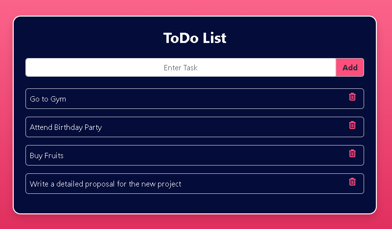
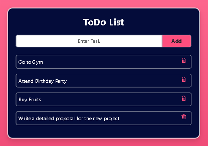
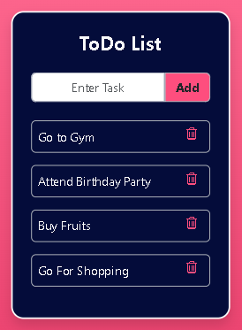

# To-Do List Application Using React, MySQL, Node, and Express

This To-Do list application combines the power of React, MySQL, Node.js, and Express.js to provide a comprehensive task management solution. Users can effortlessly create and delete tasks, ensuring efficient task organization and productivity.

## Table of Contents

- [Introduction](#introduction)
- [Features](#features)
- [Installation](#installation)
- [Usage](#usage)
- [Screenshots](#screenshots)
- [License](#license)
- [Additional Information](#additional-information)

## Introduction

The To-Do list application is an enhanced version of the previous project, now incorporating MySQL for backend data storage and introducing a delete functionality. This application allows users to create and manage their tasks effectively.

The application uses a combination of Node.js, Express.js, and MySQL for the backend, while React powers the front end. Users can input tasks into the designated input box, which are securely stored using MySQL. The tasks are neatly displayed in the tasks list section below and can be deleted by clicking the delete icon.

## Features

- **Backend Integration:** Utilizes Node.js and Express.js for backend server functionality, now with MySQL integration for data storage instead of Node-persist.
- **React Frontend:** Employs React for the frontend interface, providing a dynamic and responsive user experience.
- **Task Management:** Users can add new tasks using the input form and view existing tasks in a list format.
- **Delete Functionality:** Introduces a delete icon for each task item, enabling users to remove completed tasks from the list.
- **Data Persistence:** Tasks are securely stored in a MySQL database, ensuring data retention across sessions.

## Installation

To install the necessary dependencies for the frontend and backend folders separately, follow these steps:

1. Navigate to the `frontend` folder and then `react-todo` folder run `npm install` to install frontend dependencies.
2. Navigate to the `backend` folder and run `npm install` to install backend dependencies.

## Usage

1. Make sure you have MySQL installed and running on your machine.
2. Create a MySQL database named 'todo' and table named `task` using the provided SQL commands in the project.
3. Update the MySQL connection details in the `index.js` file to match your MySQL configuration.
4. To run the backend and frontend separately:

   - In the `backend` folder, run `node index.js` to start the backend server on port 5000.
   - In the `react-todo` folder, run `npm start` to start the frontend server.
  
## Screenshots

<strong>Home</strong>

<strong>Home on iPad</strong>

<strong>Home on Phone</strong>

     
## License

This project is not licensed.

## Additional Information

For any questions or further information, please contact [nknithi2018@gmail.com](mailto:nknithi2018@gmail.com).
